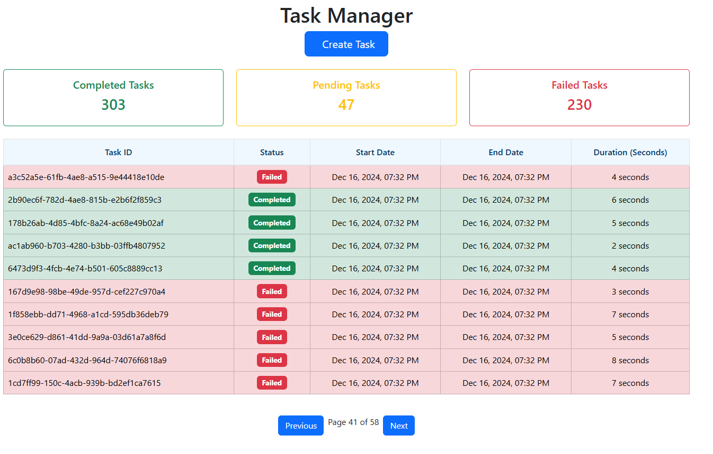

# NetTasker

NetTasker is a demo application that combines both HTTP and WebSocket protocols to enhance the user experience. It showcases the integration of a FastAPI-based backend and a Vue.js-based frontend, managed with Docker for streamlined deployment.



## Coverage Badges

| **Framework** | **Coverage** |
|---------------|--------------|
|  |  |


## Features

- **FastAPI Backend**: A robust and scalable backend for handling tasks and real-time communication.
- **Vue.js Frontend**: An interactive and user-friendly interface.
- **WebSocket Support**: Enables real-time updates for an enhanced user experience.
- **Docker Integration**: Simplifies setup and deployment with `docker-compose`.

## Project Structure

```
NetTasker-main
├── .env                  # Contains environment variables
├── .gitignore              # Git ignore file
├── README.md               # Project documentation
├── docker-compose.yml      # Docker Compose configuration
├── fastapi-task-app        # Backend application              
├── vue-task-app            # Frontend application
```

## Prerequisites

- Docker and Docker Compose installed on your system.
- Basic knowledge of FastAPI, Vue.js, and Docker.

## Setup and Installation

### Using Docker Compose

1. Clone the repository:

   ```bash
   git clone https://github.com/your-repo/NetTasker.git
   cd NetTasker-main
   ```

2. Build and start the services:

   ```bash
   docker-compose up --build
   ```

3. Access the application:

   - Frontend: [http://localhost:8080](http://localhost:8080)
   - Backend API: [http://localhost:8000](http://localhost:8000)

### Manual Setup

#### Backend (FastAPI)

1. Navigate to the `fastapi-task-app` directory:
   ```bash
   cd fastapi-task-app
   ```
2. Create a virtual environment and install dependencies:
   ```bash
   python3 -m venv venv
   source venv/bin/activate
   pip install -r requirements.txt
   ```
3. Create a .env file:

   ```
   DB_USER=your_user
   DB_PASSWORD=your_password
   DB_HOST=your_host
   DB_PORT=your_port
   DB_NAME=your_database
   ```

4. Run the backend server:
   ```bash
   uvicorn app.main:app --reload
   ```

#### Frontend (Vue.js)

1. Navigate to the `vue-task-app` directory:
   ```bash
   cd vue-task-app
   ```
2. Install dependencies:
   ```bash
   npm install
   ```
3. Run the development server:
   ```bash
   npm run serve
   ```

## Testing

### Backend Tests

1. Navigate to the `fastapi-task-app` directory.
2. Run the tests using `pytest`:
   ```bash
   pytest
   ```

### Frontend Tests

1. Navigate to the `vue-task-app` directory.
2. Run the tests:
   ```bash
   npm run test
   ```

## Contributing

Contributions are welcome! Please fork the repository and submit a pull request.

## License

This project is licensed under the MIT License. See the `LICENSE` file for details.

## Contact

For any inquiries, please contact [nunocarvalhodossantos@gmail.com](mailto\:nunocarvalhodossantos@gmail.com)

